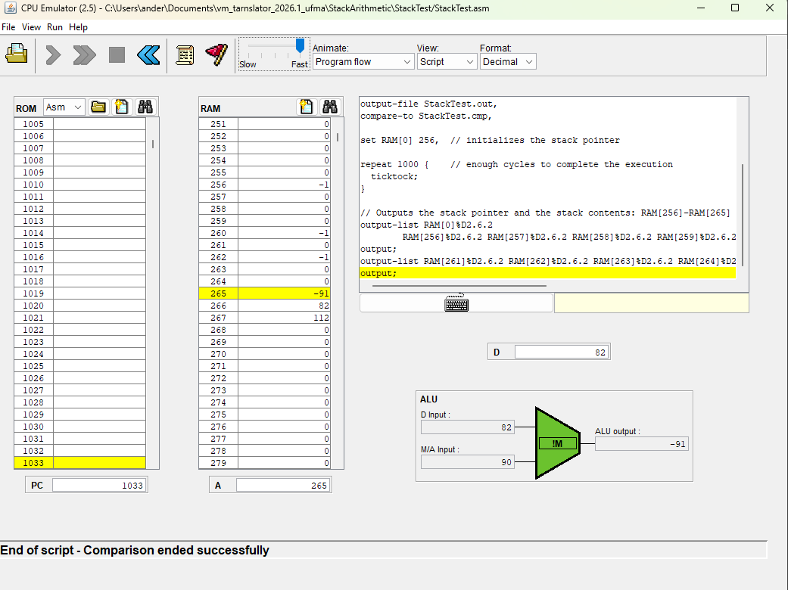

# 🚀 VM Translator - UFMA 2026.1


Projeto desenvolvido para a disciplina de **Compiladores** da Universidade Federal do Maranhão (UFMA). O objetivo é construir um tradutor VM → Assembly Hack.

---

## 👥 Integrantes

| Nome                             | Matrícula   |
| :------------------------------- | :---------- |
| **Anderson Almeida da Silveira** | 20240065590 |
| **Jeysraelly Almone da Silva**   | 20250071222 |

---

## 🛠️ Tecnologias Utilizadas

* **Linguagem:** Python 3.13
* **Gerenciador de Pacotes:** `uv`
* **Framework de Testes:** `pytest`

---

### ⚙️ Instalação e Configuração

Siga os passos abaixo para preparar o ambiente de desenvolvimento:

1. **Clonar o repositório:**
   ```bash
   git clone https://github.com/andersonpog/vm_tarnslator_2026.1_ufma.git
   cd vm_tarnslator_2026.1_ufma
   ```

2. **Criar o Ambiente Virtual (.venv):**
   O `uv` gerencia o ambiente virtual de forma otimizada. Para criar e configurar a versão correta do Python, execute:
   ```bash
   uv venv
   ```

3. **Ativar o Ambiente Virtual:**
   Dependendo do seu sistema operacional, o comando de ativação muda:
    **Windows (PowerShell):**
     ```powershell
     .venv\Scripts\Activate.ps1
     ```
    **Linux / macOS:**
     ```bash
     source .venv/bin/activate
     ```

4. **Instalar Dependências:**
   Com o ambiente ativo, instale os pacotes necessários:
   ```bash
   uv pip install -r requirements.txt
   ```


---


## Estrutura do Projeto

* `parser.py`: responsável pela leitura e interpretação dos comandos presentes no arquivo VM.
* `code_writer.py`: responsável pela geração do código Assembly correspondente aos comandos identificados pelo parser.
* `main.py`: realiza a integração entre os módulos do sistema, coordenando o processo de tradução.
* `tests/`: contém os arquivos utilizados para validação das funcionalidades implementadas.

---

## Funcionalidades Implementadas

### Parser

* Leitura de arquivos VM;
* Remoção de comentários e linhas em branco;
* Identificação do tipo de comando;
* Recuperação dos argumentos associados a cada instrução.

### Operações Aritméticas e Lógicas

* `add`
* `sub`
* `neg`
* `and`
* `or`
* `not`

### Operações Relacionais

* `eq`
* `gt`
* `lt`

### Acesso à Memória

#### Push

* `push constant`
* `push local`
* `push argument`
* `push this`
* `push that`
* `push temp`
* `push static`

#### Pop

* `pop local`
* `pop argument`
* `pop this`
* `pop that`
* `pop temp`
* `pop static`

---

## Execução

Para executar o tradutor em um aruqivo (teste.vm por exemplo), utilize o comando:

```bash
python main.py teste.vm
```

O arquivo VM definido na função principal será processado e o código Assembly correspondente será gerado automaticamente.

---

## Exemplo de Entrada

```vm
push constant 7
push constant 8
add
pop local 0
```

## Exemplo de Saída

```asm
@7
D=A
@SP
A=M
M=D
@SP
M=M+1
@8
D=A
@SP
A=M
M=D
@SP
M=M+1
@SP
AM=M-1
D=M
A=A-1
M=D+M
@0
D=A
@LCL
D=D+M
@R13
M=D
@SP
AM=M-1
D=M
@R13
A=M
M=D

```

---

## 🧪 Executando os Testes

Foram feitos testes via scripts fornecidos pelo projeto com o CPU emulator. Um exemplo pode ser visto na imagem abaixo.


